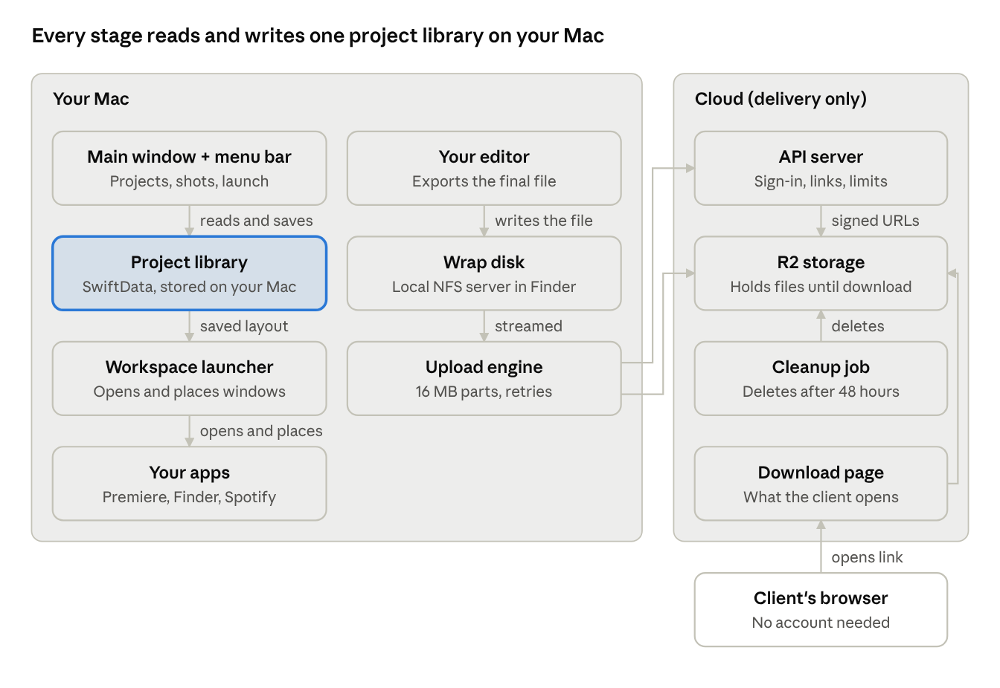
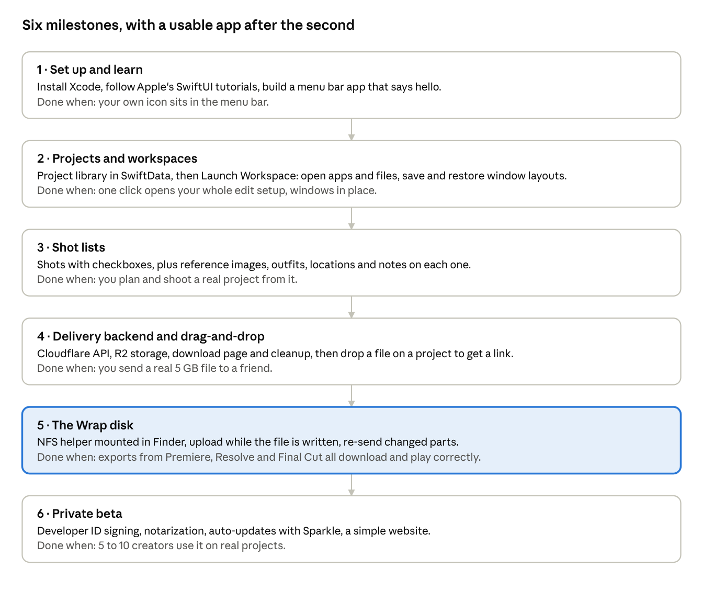

# Wrap — Creator Project Hub for Mac

> **Status:** planning. No code yet.

**Wrap** is a Mac app that follows a creative project from start to finish: plan the shots, open the edit workspace in one click, then deliver the final file with a link. It combines three ideas, Shotlist, Dockly and export-to-link delivery, into one project hub.

**Who it's for:** photographers, video editors, filmmakers and motion designers who run client or personal shoots.

## The three stages of every project

| Stage | Came from | What you do |
| --- | --- | --- |
| Plan | Shotlist | Build a shot checklist with reference images, outfits, locations and notes, then check shots off as you shoot |
| Edit | Dockly, pointed at creators | Press Launch Workspace: your editor opens with this project's file, plus the footage folder, music and anything else, each window where you like it |
| Deliver | Export-to-link | Export to the Wrap disk (or drop a file), and a client link appears that deletes itself after download |

**Why it's different:** delivery tools like DropBox only cover the last step. Wrap keeps the whole shoot in one place, and delivery knows which project and client each file belongs to.

**Not in version 1:** an iPhone app, sync between devices, team accounts, payments and Windows.

## User flow

One project, for example **ME, MYSELF & I**, moves through the three stages without leaving the app.

**Plan**

1. Press New Project, name it, and add the client's name and email (optional).
2. Add shots such as Football field, Parking lot, Stairwell, Close-up, Full body and Low angle. Drag reference images, outfit photos and location pins onto each shot, and add notes.
3. On the day, open the shot list (on the Mac for now, on iPhone later) and check shots off as you get them.

**Edit**

4. In the project's Workspace tab, add what you use: Premiere Pro with this project's `.prproj` file, the footage folder, Spotify, a client email thread.
5. Arrange the windows the way you like once, then press Save Layout.
6. From then on, Launch Workspace (from the app or the menu bar) opens everything in place. Close Workspace hides it all again.

**Deliver**

7. Export from your editor to the **Wrap** disk, or drop a file on the project.
8. The file uploads while it exports. When it's done, a link is copied and the delivery is logged on the project.
9. The client downloads in a browser, you get a notification, and the file deletes itself. You can mark the project Wrapped.

## Architecture

Planning and workspaces run entirely on your Mac, with no server. Only delivery needs the cloud.

- **Project library:** Apple's SwiftData stores projects, shots, notes, workspace layouts and delivery history in one local database. Reference images are copied into the app's own folder, so moving the originals doesn't break anything. iCloud sync can be switched on later for an iPhone app.
- **Workspace launcher:** `NSWorkspace` opens apps, files and folders. Moving and resizing other apps' windows needs the Accessibility permission, which the user grants once in System Settings.
- **Delivery:** the upload engine asks the API for signed upload URLs, then sends parts straight to R2, so big files never pass through your server. When a link is created, it's saved on the project.

## Delivery: virtual disk decision

Recommendation: prototype the disk as a **small NFS server running inside the app** and mounted by macOS, then move to **FSKit** once the product works. The disk is the hardest part of the whole project, and the only part that makes delivery more than an upload feature.

| Option | How it works | Uploads while writing? | Setup for users | Difficulty |
| --- | --- | --- | --- | --- |
| Local NFS server | The app runs a tiny NFS server on the Mac, and macOS mounts it like a network drive. rclone's `nfsmount` uses this approach on macOS. | Yes, the data arrives in pieces as the editor writes | None | Medium (the proven Go library `go-nfs` can run as a helper) |
| FSKit | Apple's official way to build a file system as an app extension (macOS 15.4 and later) | Yes | Turn on the extension once in System Settings | High (new, thin docs) |
| Local WebDAV server | Same idea as NFS, over WebDAV | Poorly: macOS's WebDAV client keeps the whole file locally until it closes | None | Low to medium |
| File Provider | The Dropbox/iCloud Drive system | No, it uploads after the file closes | None | Medium |
| macFUSE | Third-party kernel extension | Yes | Install macFUSE and allow it in Recovery settings on Apple Silicon | Medium |

**Rewrites near the start.** Some editors go back at the end of an export to fix the file header (common with .mov and .mp4). The upload engine splits the file into 16 MB parts. If an already-sent part changes, it re-sends only that part. S3 and R2 multipart uploads allow replacing a part before the upload is finalized.

**A good first step.** Before any disk work, build drag-and-drop delivery: drop a file on a project, get a link. It uses the same backend, and it's the fallback feature anyway.

## Backend & storage

Run the whole backend on Cloudflare: Workers for the API and download page, D1 (SQLite) for the database, R2 for files, and cron triggers for cleanup. It's written in TypeScript, with no servers to manage.

**API endpoints**

| Endpoint | What it does |
| --- | --- |
| `POST /auth/code` and `POST /auth/verify` | Emails a 6-digit code, then returns a session token |
| `POST /deliveries` | Starts a delivery: checks your storage limit and opens an R2 multipart upload |
| `POST /deliveries/:id/parts/:n` | Returns a signed URL for uploading part n straight to R2 |
| `POST /deliveries/:id/complete` | Finalizes the upload and returns the share link |
| `GET /d/:token` | The client's download page |
| `GET /d/:token/file` | Streams the file from R2 and marks it delivered when the stream finishes |

**Data model:** two tables. `users` holds id, email and created. `deliveries` holds id, user, file name, size, R2 key, upload id, link token, status (uploading, ready, delivered or expired), created, expires and downloaded.

**Deletion rules**

- After a completed download, delete the file after a 1-hour grace period, so a client whose download dropped can retry.
- A cron job runs every 15 minutes and deletes anything unopened after 48 hours, plus uploads abandoned partway.
- An R2 lifecycle rule deletes anything older than 3 days, as a safety net if the cron job ever fails.

**Storage limit:** a per-user cap on active files (for example 10 GB). The app states the expected size up front, and the API refuses it if the cap would be exceeded.

## Mac app UI

Wrap has a normal main window for working on projects, plus a menu bar icon for quick actions.

- **Main window:** a sidebar of projects (Active, Wrapped), and each project opens with three tabs:
  - **Shots:** a checklist with a thumbnail per shot. Click a shot to see its reference images, outfit, location and notes. A progress count reads, for example, 1 of 6 shot.
  - **Workspace:** the list of apps, files and folders to open, with Save Layout, Launch Workspace and Close Workspace buttons.
  - **Deliveries:** every file sent for this project, with its state (Uploading 62%, Link ready, Downloaded, Expired) and a copy-link button.
- **Menu bar:** recent projects with a Launch button each, uploads in progress, and your storage use.
- **Notifications:** "Link ready" with a Copy Link action, and "Your client downloaded it."
- **Settings:** launch at login, the Accessibility permission for window placement, and the delivery account.

## Roadmap

Build from easiest to hardest: each milestone leaves you with an app you can use, and the tricky delivery disk comes last.

Milestones 2 and 3 need no server and cost nothing. Milestone 4 is a usable delivery feature on its own, so milestone 5 can take as long as it needs.

## Getting started (development)

1. **Install Xcode** from the Mac App Store (free). Open it once so it installs its extra components.
2. **Learn the basics** with Apple's free SwiftUI tutorials on developer.apple.com. Focus on views, state and buttons.
3. **Backend tools (milestone 4 onward):** Node.js and Cloudflare's `wrangler` CLI (`npm install -g wrangler`), plus a free Cloudflare account.

Apple's paid developer account ($99 a year) is only needed to sign and notarize the app for other people (milestone 6).

## Costs

Milestones 1 to 3 cost nothing, since they run only on your Mac. A small private beta with delivery runs about $99 a year plus $5 a month, because files are short-lived and R2 charges nothing for downloads.

| Item | Price (USD) | When you need it |
| --- | --- | --- |
| Xcode | Free | From day one |
| [Apple Developer Program](https://developer.apple.com/support/enrollment/) | $99 per year | Milestone 6: signing and notarizing so other Macs open the app |
| [Cloudflare Workers](https://developers.cloudflare.com/workers/platform/pricing/) | Free (100,000 requests a day), or $5 a month for Paid | Free during development. Paid for the beta, because it allows long streaming downloads |
| [R2 storage](https://developers.cloudflare.com/r2/pricing/) | $0.015 per GB-month, with the first 10 GB-month free | Files only live a day or two, so average storage stays small |
| R2 uploads (Class A operations) | $4.50 per million, with 1 million a month free | One per 16 MB part: a 50 GB file is about 3,200 |
| R2 downloads (egress) | Free | Always, and it's the main reason to choose R2 |
| Domain name | Roughly $10 to $20 per year (approximate) | For the download links and website |

Prices as of September 2026.

## Risks

The biggest risk is trying to build all three stages at once: a finished Plan-and-Edit app beats a half-built everything.

| Risk | What could go wrong | Plan |
| --- | --- | --- |
| Scope | Three products in one takes too long and nothing ships | Follow the milestone order strictly, and put milestones 2 and 3 in testers' hands before starting delivery |
| Window placement | Some apps (especially Premiere and Resolve) restore their own window positions, or open slowly and ignore early moves | Wait for each window to appear before placing it, retry for a few seconds, and let users skip placement per app |
| Shot lists on set | A Mac isn't practical in the field | Accept Mac-only planning for version 1, and plan an iPhone app with iCloud sync as the first big follow-up |
| Editor compatibility for the disk | An app refuses to export to network drives, or writes in an odd pattern | Test Premiere, Resolve, Final Cut, After Effects and Lightroom from milestone 5 onward, and keep drag-and-drop as the fallback |
| Export faster than upload | A fast export on slow Wi-Fi outruns the upload | Buffer in a capped temporary folder, and warn in the menu bar if the buffer fills |
| Misuse of links | Someone uses links to share illegal files | Accounts required to upload, terms of use, a report link on every download page, and short expiry |

## Open questions

- [ ] Is "Wrap" the name, or just a placeholder?
- [ ] Do shots need custom fields (lens, time of day, model) or just the ones listed?
- [ ] Should workspaces be per project, or reusable templates that projects pick from?
- [ ] Free forever for planning and workspaces, with paid delivery? Or one price for everything?
